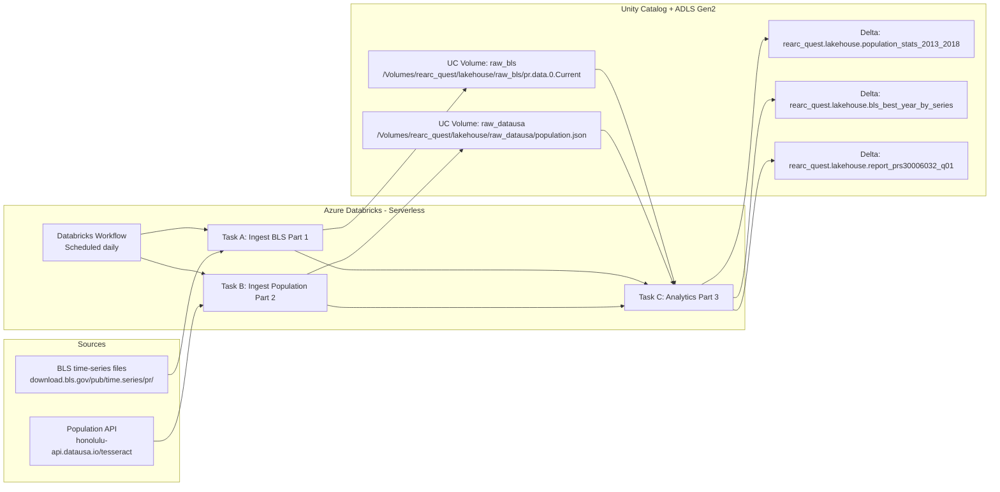

# Rearc Data Engineer Take Home Assignment

## Overview
This repository contains my solution to the Rearc Data Engineer take-home challenge.

## Architecture

### How to read this architecture
1. Two independent ingestion tasks pull data from external public sources
2. Raw data is stored in Unity Catalog Volumes backed by ADLS Gen2
3. Analytics runs only after both ingestions succeed
4. Curated outputs are written as Delta tables in Unity Catalog
5. Everything runs on Databricks Serverless compute

This architecture mirrors the intent of the original AWS-based design, but uses Databricks-native primitives instead of Lambda, SQS, and S3 notifications.

