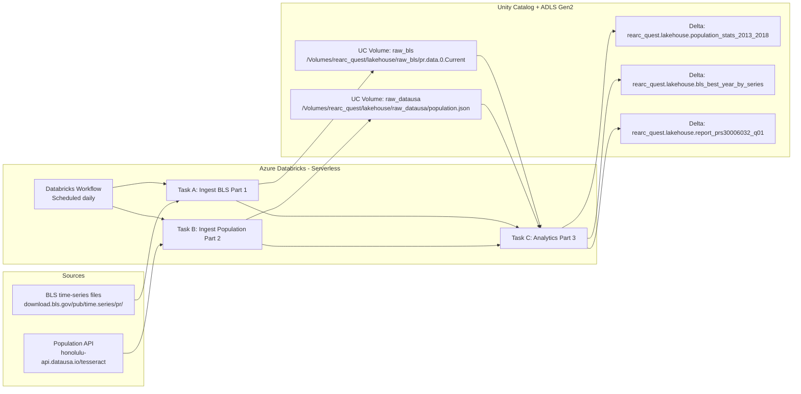

# Rearc Data Engineer Take Home Assignment

## Overview
This repository contains my solution to the Rearc Data Engineer take-home challenge.

## Architecture

### How to read this architecture
1. Two independent ingestion tasks pull data from external public sources
2. Raw data is stored in Unity Catalog Volumes backed by ADLS Gen2
3. Analytics runs only after both ingestions succeed
4. Curated outputs are written as Delta tables in Unity Catalog
5. Everything runs on Databricks Serverless compute

This architecture mirrors the intent of the original AWS-based design, but uses Databricks-native primitives instead of Lambda, SQS, and S3 notifications.

## Design Decisions & Trade-offs

### 1. Why Unity Catalog Volumes for raw data
Raw data (BLS files and API JSON) is stored in UC Volumes instead of unmanaged cloud paths.
#### Why this matters:
1. Volumes provide governed, discoverable access to object storage
2. Permissions, lineage, and auditing are handled centrally
3. Works seamlessly with serverless compute
4. Clean separation between raw and curated layers

This aligns with modern lakehouse best practices.

### 2. Why overwrite-in-place for the API dataset
The population API output is written to a fixed path and overwritten on each run:
/Volumes/rearc_quest/lakehouse/raw_datausa/population.json

#### What we considered:
Versioned paths (ingest_date=YYYY-MM-DD/)
File-arrival-based event triggers

#### Why overwrite was chosen:
1. The Quest requires the latest API data, not historical snapshots
2. Overwrite-in-place keeps the pipeline deterministic
3. Analytics always reads a single, well-known location
4. Avoids additional logic to discover “latest” partitions

This is a deliberate simplicity trade-off suitable for this assignment.

### 3. Why tasks + dependencies instead of file arrival triggers
In Databricks, analytics can be triggered either by:
1. File arrival events, or
2. Workflow task dependencies
We chose task dependencies.

#### Why file arrival was not used:
1. Overwriting an existing file does not always emit a reliable “new file” event
2. This can lead to nondeterministic behavior
3. Serverless environments favor explicit orchestration

#### Why task dependencies are better here:
1. Analytics always runs after successful ingestion
2. Clear execution order and failure visibility
3. Easier to reason about and debug
4. Direct replacement for “SQS + Lambda chaining” in AWS

This choice prioritizes reliability and clarity over architectural complexity.

## Workflow Orchestration (Part 4)
The entire pipeline is orchestrated using a single Databricks Workflow.
### Workflow Structure:
Task A – Ingest BLS (Part 1)
Downloads and stores BLS time-series data

Task B – Ingest Population API (Part 2)
Calls the public API and stores the JSON response

Task C – Analytics (Part 3)
Runs only after Tasks A and B succeed

Tasks A and B run independently and in parallel.
Task C depends on the successful completion of both.

Trigger
Scheduled daily
Serverless compute for all tasks

This design replaces:
AWS Lambda → Databricks notebooks
SQS → task dependencies
CloudWatch logs → Databricks job run logs

## Implementation Breakdown

### Part 1 – BLS Ingestion
Reads BLS directory listings
Downloads the pr.data.0.Current file
Stores it in a UC Volume
Parsing is deferred to analytics to keep raw data immutable

### Part 2 – Population API Ingestion
Calls the DataUSA Tesseract API
Includes retry, backoff, and timeout handling
Writes JSON output to UC Volume
Overwrites the previous snapshot to represent “latest state”

### Part 3 – Analytics
All analytics are implemented using PySpark DataFrames, not pandas.

Key computations:
1. Mean and standard deviation of US population (2013–2018)
2. Best year per BLS series (max annual sum)
3. Joined report for PRS30006032, Q01, and population by year

Outputs are written as Delta tables in Unity Catalog.

## Additional Analysis (Beyond Requirements)
To demonstrate analytical depth beyond the assignment requirements, the following analyses were added:
1. Population trend analysis
2. Year-over-year population growth to assess stability and volatility
3. Series volatility analysis
Coefficient of variation per BLS series to identify stable vs volatile indicators
Per-capita normalization
BLS values normalized by population to enable fair cross-year comparison

## How to Run
This project is designed to run entirely within Azure Databricks using serverless compute and Databricks Workflows.

### Prerequisites
An Azure Databricks workspace with:
1. Unity Catalog enabled
2. Access to serverless compute
3. An ADLS Gen2 storage account registered with Unity Catalog
4.Network access to public endpoints:
  1. download.bls.gov
  2. honolulu-api.datausa.io

### One-time Setup

Create catalog and schema (if not already present):
CREATE CATALOG IF NOT EXISTS rearc_quest;
CREATE SCHEMA IF NOT EXISTS rearc_quest.lakehouse;

Create Unity Catalog volumes for raw data:
CREATE VOLUME IF NOT EXISTS rearc_quest.lakehouse.raw_bls;
CREATE VOLUME IF NOT EXISTS rearc_quest.lakehouse.raw_datausa;

Import notebooks into the Databricks workspace:
10_ingest_bls
11_ingest_population
20_analytics_part3_serverless

### Running the Pipeline via Databricks Workflow (Recommended)
Navigate to Workflows in the Databricks UI

Create a new job named:
rearc_quest_pipeline

Add the following tasks:
Task A: 10_ingest_bls
Task B: 11_ingest_population
Task C: 20_analytics_part3_serverless
Configure Task C to depend on Task A and Task B
Set compute for all tasks to Serverless
Configure a daily schedule (or run manually for testing)

The workflow ensures analytics runs only after both ingestion tasks complete successfully.

### Manual Execution (for testing)
Each notebook can also be run independently:
Run 10_ingest_bls to ingest BLS time-series data
Run 11_ingest_population to fetch and store population API data
Run 20_analytics_part3_serverless to generate analytical outputs
Manual execution is useful for development and debugging.

### Verifying Outputs
After a successful run, verify the following:
Raw data (Unity Catalog Volumes)

BLS data:
/Volumes/rearc_quest/lakehouse/raw_bls/pr.data.0.Current

Population API data:
/Volumes/rearc_quest/lakehouse/raw_datausa/population.json

Curated Delta tables
SELECT * FROM rearc_quest.lakehouse.population_stats_2013_2018;
SELECT * FROM rearc_quest.lakehouse.bls_best_year_by_series;
SELECT * FROM rearc_quest.lakehouse.report_prs30006032_q01;

### Failure Handling & Retries
External API calls include retry and backoff logic to handle transient network issues
Workflow tasks can be retried independently in Databricks
Analytics runs only when upstream ingestion succeeds

## Final Notes
All notebooks are serverless-compatible
No unsupported persistence commands are used
The pipeline is deterministic, restartable, and easy to reason about
Design choices prioritize clarity, reliability, and correctness

